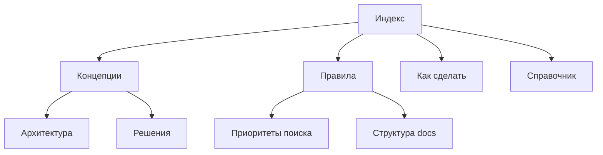

# Главный индекс документации

Добро пожаловать в документацию ComminusmPlugin — сатирического Minecraft плагина для PaperSpigot, реализующего цифровой коммунизм.

## Структура документа

Вся документация следует фреймворку **Diátaxis**, организованному в четыре рода:

### 📘 Концепции (`concepts/`)
Объяснения архитектуры, принятых решений и фундаментальных принципов проекта.

- [[concepts|Каталог концепций]] — все концепции и объяснения
- [[concepts/architecture|Архитектура]] — структура проекта и технологии
- [[concepts/decisions/001-kotlin-implementation|Решение: Kotlin]] — выбор языка программирования
- [[concepts/decisions/002-paperspigot-platform|Решение: PaperSpigot]] — выбор серверной платформы
- [[concepts/decisions/003-gradle-kotlin-dsl|Решение: Gradle KDSL]] — система сборки

### 📗 Правила (`guidelines/`)
Правила, которым нужно следовать при разработке.

- [[guidelines|Каталог правил]] — все правила проекта
- [[guidelines/search-rule|Правило поиска]] — приоритеты поиска информации
- [[guidelines/documentation-structure|Структура документации]] — как организовывать документы

### 📙 Как сделать (`how-to/`)
Пошаговые инструкции для выполнения задач.

- [[how-to|Каталог инструкций]] — все пошаговые туториалы
- [[how-to/run-locally|Запуск плагина локально]] — как запустить сервер для тестирования
- [[how-to/create-doc|Создать документацию]] — как создать новые документы

### 📕 Справочник (`reference/`)
Факты, API, конфигурации.

- [[reference|Каталог справочника]] — все справочные материалы
- [[reference/configuration|Конфигурация проекта]] — build.gradle, settings, plugin.yml
- [[reference/plugin-class|Основной класс плагина]] — ComminusmPlugin
- [[reference/build-tools|Инструменты сборки]] — Gradle задачи и команды
- [[reference/paperspigot-api|PaperSpigot API]] — API документация и рекомендации
- [[reference/dev-setup|Настройка среды]] — как настроить IDE и окружение
- [[reference/code-style|Стиль кода]] — Kotlin и PaperSpigot конвенции
- [[reference/versioning|Версионирование]] — Semver и release process
- [../CHANGELOG.md|История изменений]] — все важные изменения в проекте

## Быстрый старт для разработчиков

1. **Читайте концепции** — поймите архитектуру проекта
2. **Следуйте правилам** — соблюдайте правила поиска и документирования
3. **Используйте как сделать** — следуйте пошаговым инструкциям
4. **Справочник** — обращайтесь за API и конфигами

## Дополнительные ресурсы

- [[vault/README|README vault]] — как работать с документацией
- [[concepts/README|README концепций]]
- [[concepts/decisions/README|README решений]]
- [[guidelines/README|README правил]]
- [[how-to/README|README инструкций]]
- [[reference/README|README справочника]]
- [[guidelines/search-rule|Правило поиска]] — приоритеты поиска информации
- [../CHANGELOG.md|История изменений]] — отслеживание релизов и изменений
- [../README.md|README проекта]] — оглавление проекта

## Связи между документами

## Важные ссылки

- [[_INDEX.md]] — этот документ
- [[concepts/architecture|Архитектура проекта]]
- [[concepts/decisions/001-kotlin-implementation|Решение: Kotlin]]
- [[concepts/decisions/002-paperspigot-platform|Решение: PaperSpigot]]
- [[concepts/decisions/003-gradle-kotlin-dsl|Решение: Gradle KDSL]]
- [[guidelines/documentation-structure|Структура документации]]
- [[reference/configuration|Конфигурация проекта]]
- [../CHANGELOG.md|История изменений]

---

**Пролетарии всех биомов, соединяйтесь!** 🌍⚔️
