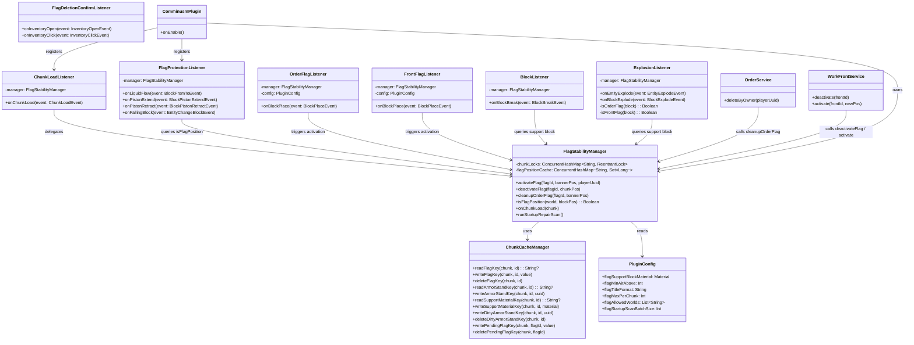
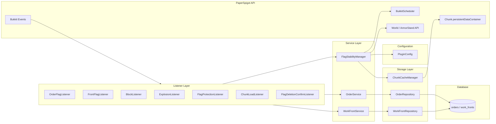
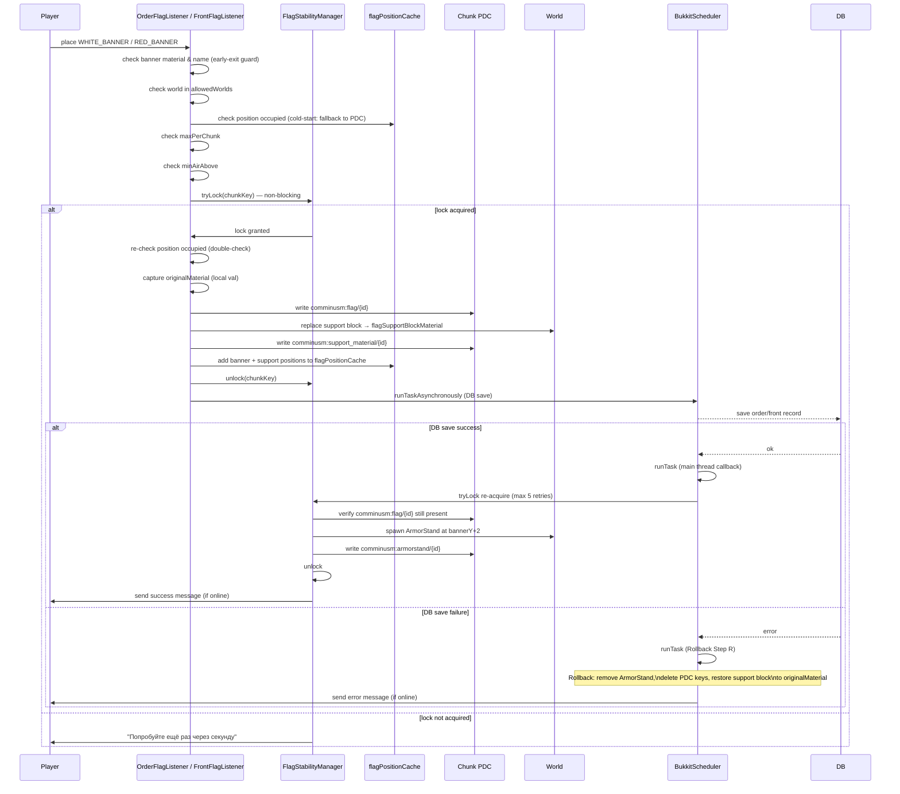
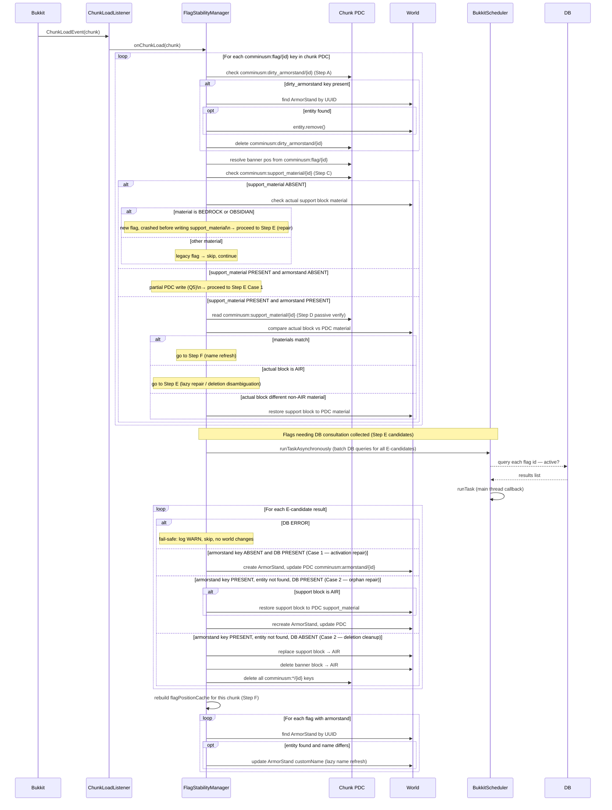
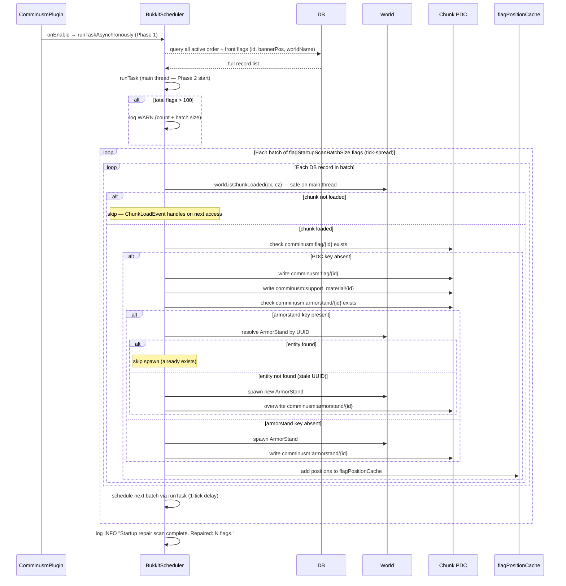

# Flag Stability — UML Diagrams

> Source: spec `vault/reference/comminusm/spec/flag-stability.md`, test cases `vault/reference/comminusm/test-cases/flag-stability-test-cases.md`
> Generated by @SystemAnalyst in DIAGRAM mode.

---

## Structural

### Class diagram



### Component diagram



---

## Behavioral

### Sequence — US-01/US-02: Flag Activation (Order / Front)



### Sequence — US-05: Flag Deletion (Order via GUI)

```mermaid
sequenceDiagram
    participant Player
    participant GUI as FlagDeletionConfirmListener
    participant Manager as FlagStabilityManager
    participant PDC as Chunk PDC
    participant World
    participant Cache as flagPositionCache
    participant Scheduler as BukkitScheduler
    participant DB

    Player->>GUI: open deletion GUI
    GUI->>DB: re-validate ownership (UUID match)
    alt owner mismatch
        GUI->>Player: close GUI, permission denied
    else owner confirmed
        Player->>GUI: click confirm slot
        GUI->>DB: re-query order record (TOCTOU guard)
        alt record missing or owner changed
            GUI->>Player: "Флаг уже был удалён или недоступен"
        else record valid
            GUI->>Manager: tryLock(chunkKey) — non-blocking (max 5 ticks retry)
            Manager->>PDC: check comminusm:flag/{id} exists (idempotency guard)
            alt PDC key absent — already deleted
                Manager->>Manager: return without changes
            else PDC key present
                Manager->>PDC: read comminusm:armorstand/{id} → UUID
                Manager->>World: find ArmorStand by UUID (fallback: bounding box scan)
                Manager->>World: entity.remove() ArmorStand
                Manager->>World: replace support block → AIR
                Manager->>World: delete banner block → AIR
                Manager->>PDC: delete comminusm:armorstand/{id}
                Manager->>PDC: delete comminusm:flag/{id}
                Manager->>PDC: delete comminusm:support_material/{id}
                Manager->>Cache: evict banner + support positions
                Manager->>Manager: unlock(chunkKey)
                Manager->>Scheduler: runTaskAsynchronously (DB record delete)
                Scheduler-->>DB: delete order record
                alt DB delete failure
                    DB-->>Scheduler: error
                    Scheduler->>Scheduler: log ERROR (orphaned DB record; world clean)
                end
            end
        end
    end
```

### Sequence — US-06: Front Move

```mermaid
sequenceDiagram
    participant Player
    participant FrontService as WorkFrontService
    participant Manager as FlagStabilityManager
    participant PDC_new as New Chunk PDC
    participant PDC_old as Old Chunk PDC
    participant World
    participant Scheduler as BukkitScheduler
    participant DB

    Player->>FrontService: move front to new position
    FrontService->>Manager: compute canonical lock order (newKey vs oldKey)
    Manager->>Manager: tryLock(first key per canonical order — Step 1)
    Manager->>Manager: pre-conditions for new position (air-above, occupied, maxPerChunk)
    alt pre-conditions fail
        Manager->>Player: send error, release lock
    else pre-conditions pass
        Manager->>Scheduler: runTaskAsynchronously (DB update to new coords — Step 3)
        Scheduler-->>DB: update work_fronts record
        alt DB update failure
            DB-->>Scheduler: error
            Scheduler->>Player: send error, release new lock; no world changes
        else DB update success
            Scheduler->>Scheduler: runTask (main thread callback — Step 4)
            Manager->>Manager: tryLock re-acquire new chunk (max 5 retries)
            alt all 5 retries exhausted
                note over Manager: Step 4R Rollback:\nschedule async DB revert to old coords
            else lock acquired
                Manager->>PDC_new: write comminusm:flag/{id} = new banner pos (crash-recovery anchor)
                Manager->>PDC_new: write comminusm:support_material/{id} = material at new support pos
                Manager->>Manager: tryLock(second key — OLD chunk — Step 6)
                Manager->>World: remove old ArmorStand
                Manager->>World: replace old support block → AIR
                Manager->>World: delete old banner block → AIR
                Manager->>PDC_old: delete comminusm:flag/{id}
                Manager->>PDC_old: delete comminusm:armorstand/{id}
                Manager->>PDC_old: delete comminusm:support_material/{id}
                Manager->>Manager: unlock(OLD chunk — Step 11)
                Manager->>World: place new support block → flagSupportBlockMaterial (Step 12)
                Manager->>World: spawn new ArmorStand at new bannerY+2 (Step 13)
                alt ArmorStand spawn failure
                    note over Manager: Step 13R Rollback:\nrestore new support block to newOriginalMaterial,\ndelete new PDC keys, DB retains new coords.\nStartup repair scan recovers on next start.
                    Manager->>Player: "Ошибка перемещения, флаг будет восстановлен автоматически"
                else ArmorStand spawned
                    Manager->>PDC_new: write comminusm:armorstand/{id} (Step 14)
                    Manager->>Manager: unlock(NEW chunk — Step 15)
                    Manager->>Player: send success message (if online)
                end
            end
        end
    end
```

### Sequence — ChunkLoadEvent: Crash-Recovery Repair



### Sequence — Startup Repair Scan



---

## State — Flag Lifecycle

```mermaid
stateDiagram-v2
    [*] --> INACTIVE : flag item in player inventory

    INACTIVE --> ACTIVATING : player places banner\n(pre-conditions pass, lock acquired)

    ACTIVATING --> ACTIVE : ArmorStand spawned,\nPDC keys written, DB saved

    ACTIVATING --> ROLLBACK_PENDING : DB save fails OR\nArmorStand spawn fails

    ROLLBACK_PENDING --> INACTIVE : rollback complete\n(support block restored,\nPDC keys deleted,\nplayer message sent)

    ROLLBACK_PENDING --> DIRTY_ARMORSTAND : ArmorStand.remove() fails\nduring rollback

    DIRTY_ARMORSTAND --> INACTIVE : ChunkLoadEvent cleans\ndirty_armorstand marker

    ACTIVE --> MOVE_IN_PROGRESS : owner moves front\n(Step 3 DB update begins)

    MOVE_IN_PROGRESS --> ACTIVE : move completed\n(new ArmorStand + PDC + support block\nplaced at new position)

    MOVE_IN_PROGRESS --> ACTIVE : Step 13R rollback\n(new pos rolled back;\nstartup scan re-completes\non next server start)

    ACTIVE --> DEACTIVATING : deleteByOwner or\ndeactivate called,\nchunk lock acquired

    DEACTIVATING --> DELETED : world cleanup complete\n(support block AIR,\nArmorStand removed,\nPDC keys deleted,\nDB record deleted)

    ACTIVE --> CRASHED_PARTIAL : server crash mid-activation\nor mid-deletion

    CRASHED_PARTIAL --> ACTIVE : ChunkLoadEvent repair\n(Section 9 Step E)\nor Startup Repair Scan

    CRASHED_PARTIAL --> DELETED : ChunkLoadEvent repair\ndetects DB absent →\nworld cleanup completed

    DELETED --> [*]
```
